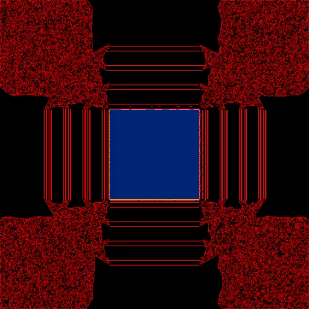

---

layout: event
title: Computational art meetup: GLSL
date: 28.10.2020 19:00
event_description: Обзор GLSL пайплайна, программирование fragment shaders
end_date: 28.10.2020 22:00

---

Цель встречи: Программирование фрагментных шейдеров, создание аудиовизуальных демо.

[Андрей](https://t.me/withermute) расскажет про GLSL пайплайн.

[Саша](https://t.me/algroznykh) расскажет, как использовать фрагментарные шейдеры для моделирования динамических систем на примере клеточных автоматов.

Кодим, смотрим, что получилось, на проекторе.

Мы сами только начинаем разбираться с этой темой, будьте готовы работать самостоятельно! 

Пожалуйста, прочитайте, что такое [фрагментарные шейдеры](https://thebookofshaders.com/01/?lan=ru) до встречи, и установите необходимую [среду разработки](https://hexler.net/products/kodelife)

Пожалуйста, [зарегистрируйтесь](https://forms.gle/UpcRSJhd6yw2tUEr7) 
Количество мест ограничено. 
