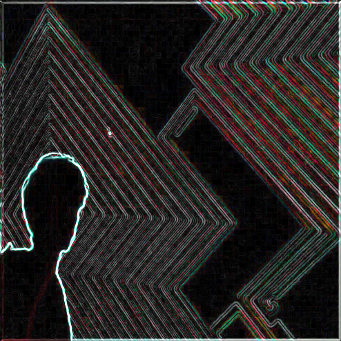

---

layout: event
title: "Computational art workshop #1: GLSL"
date: 4.14.2020 19:00
event_description: Обзор OpenGL пайплайна, программирование fragment shaders
end_date: 4.11.2020 22:00

---

Цель встречи: Программирование шейдеров, создание аудиовизуальных демо.

[Саша](https://t.me/algroznykh) сделает небольшой доклад о compute shaders.

Основная часть встречи -- кодим, смотрим результаты на проекторе.

Мы сами только начинаем разбираться с этой темой, будьте готовы работать самостоятельно! 

