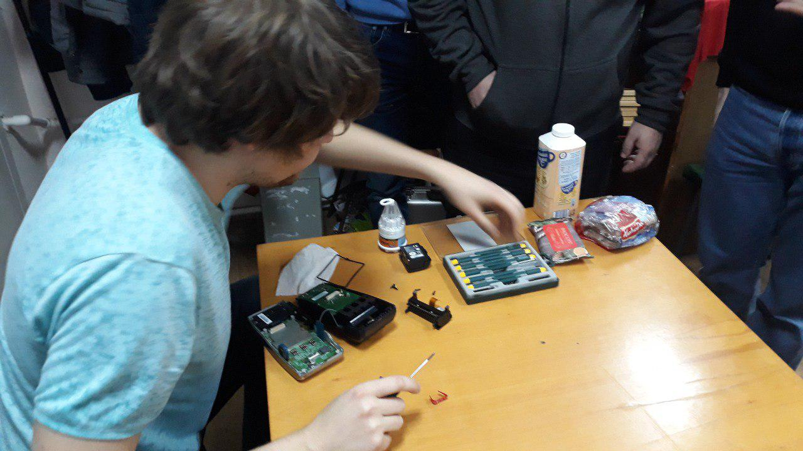
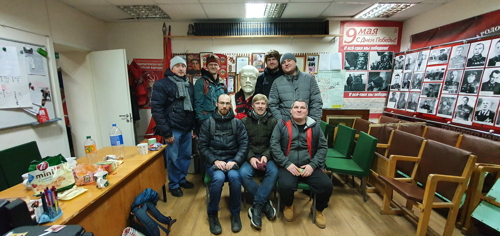
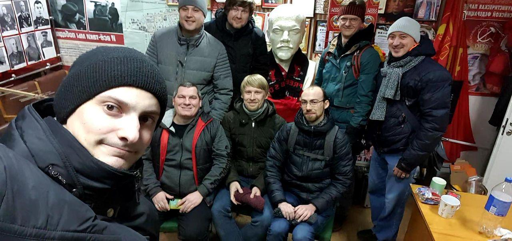

В Киришах есть хакспейс [vk](https://vk.com/cyberunit) [страница на hackerone](https://hackerone.com/cyberunit)

Сергей aka разведчик давно с ними базарил насчет того, чтобы приехать к ним в гости, ребята не против, вот мы и думаем собраться какой-то толпой и поехать.

Добираться до Киришей долго - 2:40 на электричке. Из-за продолжительности и состава участников можно считать это внеочередной выездной сессией 2600. Под стук колёс и с пролетающими за окнами деревьями и полями мы обудили последние новости IT, защиты информации, а также быт и планы H4CKSP4CE.

Кириши встретил нас сухой тёплой (для декабря) погодой.

По прибытии в спейс началось знакомство и общение. Cyberunit располагается в офисе КПРФ, отсюда и вся коммунистическая символика. 

Один из участников увлечён радиоупраляемыми моделями и прочим этим вашим FPV.

Киришские ребята похвастались POS терминалом, который в дальнейшем подарили нашему спейсу.
Не разобрать его было невозможно.

Обсудили множество тем: организация хакспейса, SDR, фото со спутников, коптеры и многое другое.

Уже после выхода в сторону вокзала поняли, что не сделали совместное фото. В антураже коммунистического офиса получилось очень колоритно.

Договорились с участниками Cyberunit о дальнейшем сотрудничестве, в том числе и вне рамок хакспейсов. Ждём их к нам в гости, чтобы и у нас была возможность проявить такую же гостеприимность и радушие.
